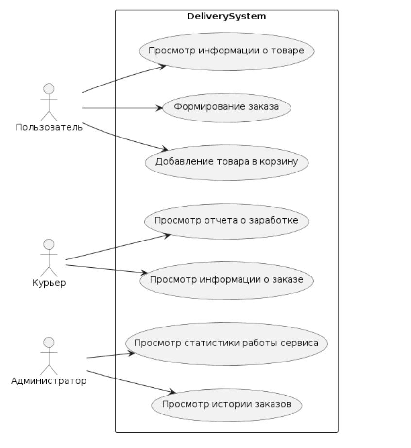
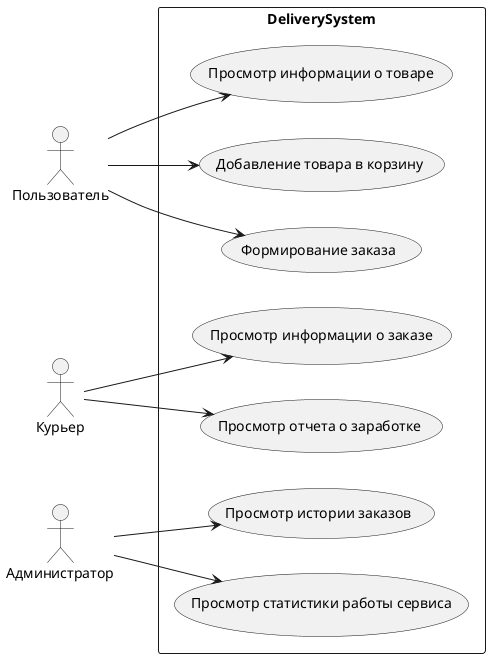
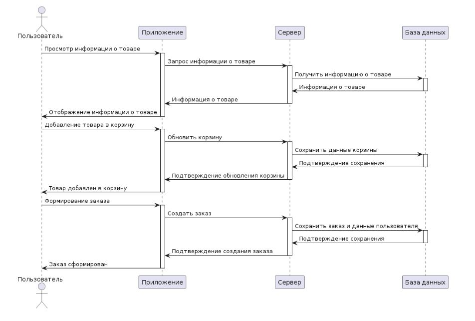
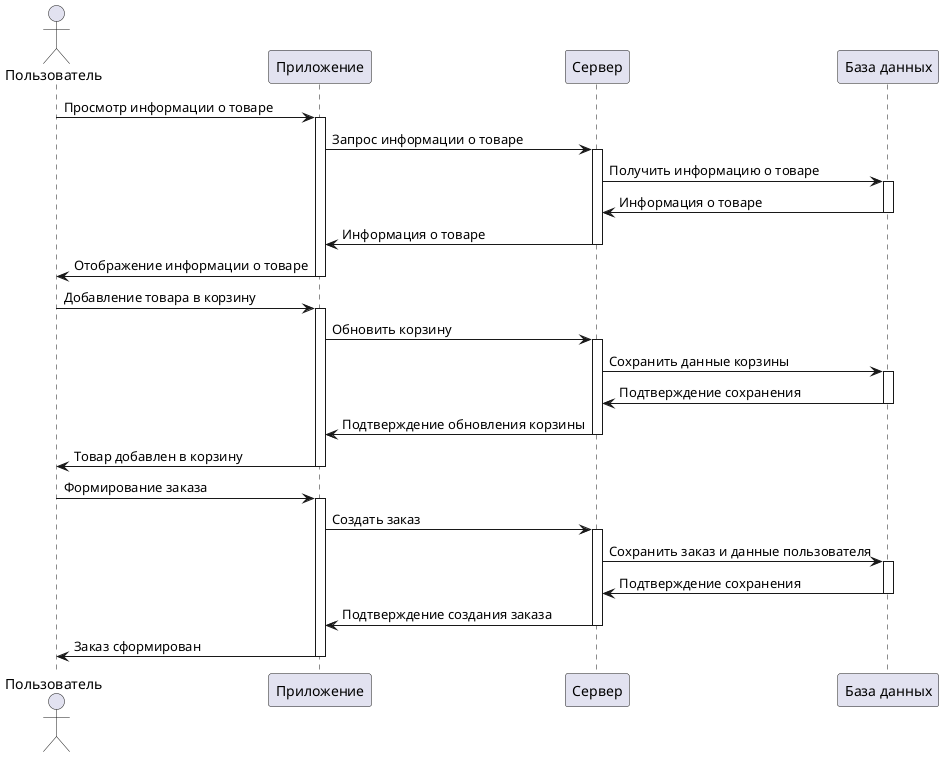
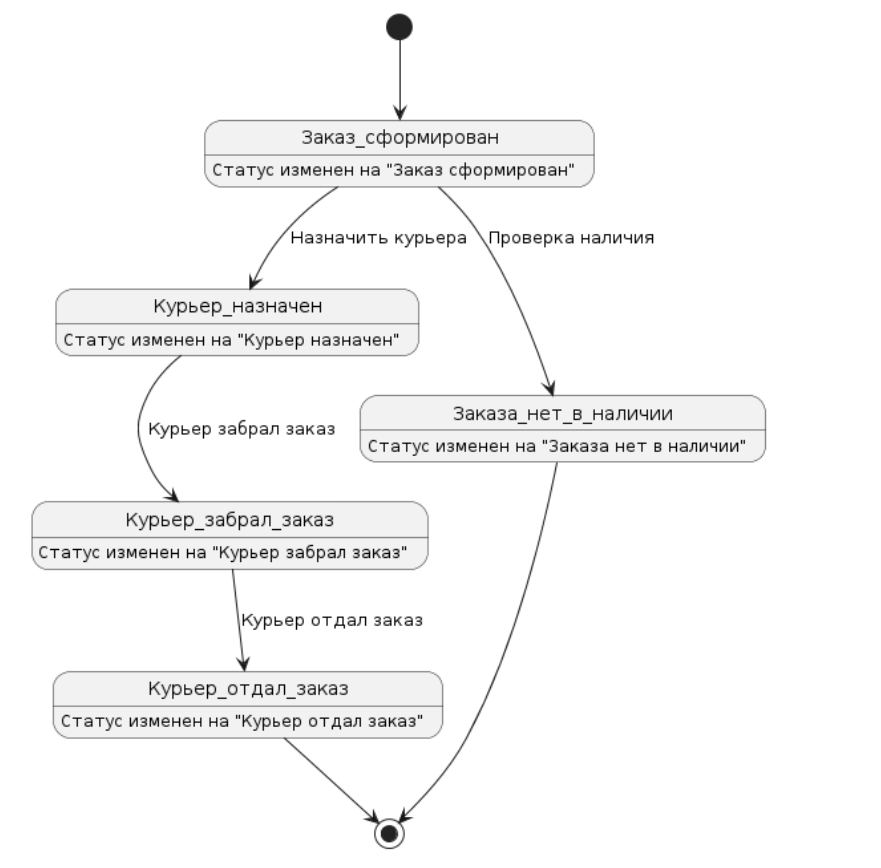
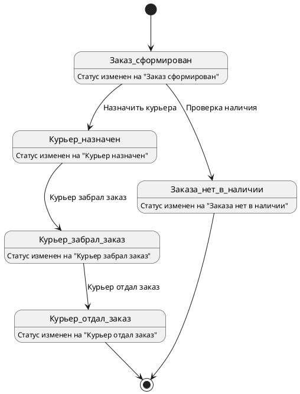
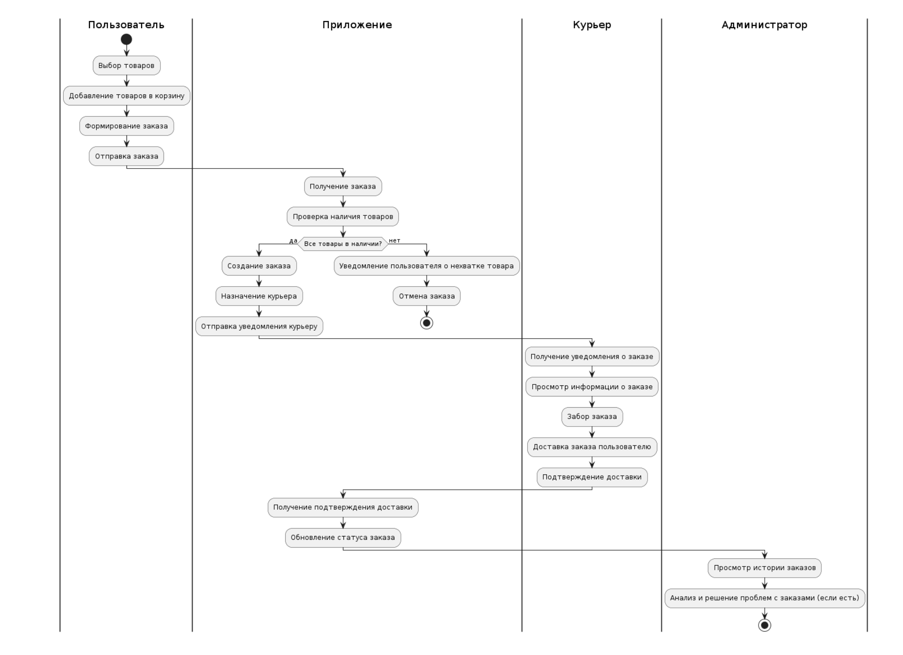
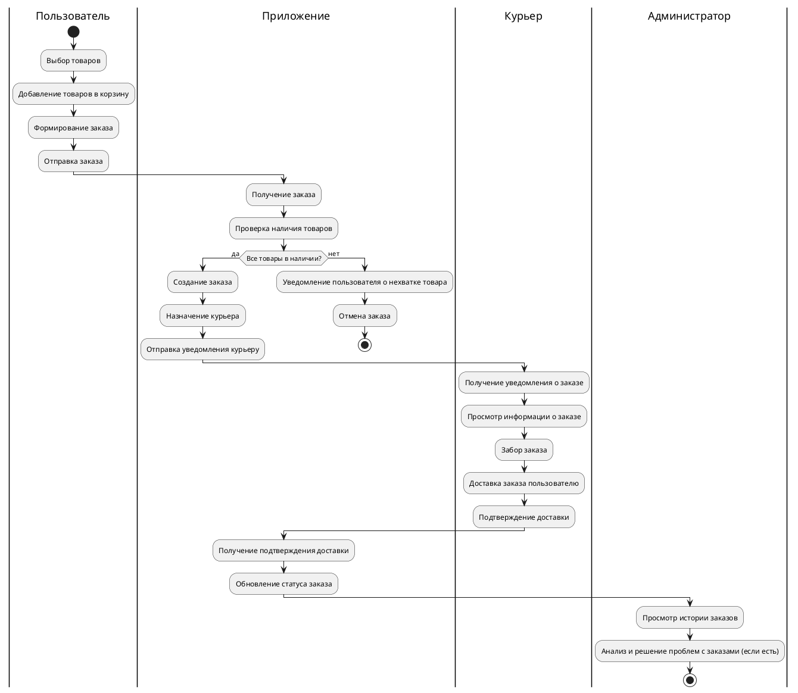
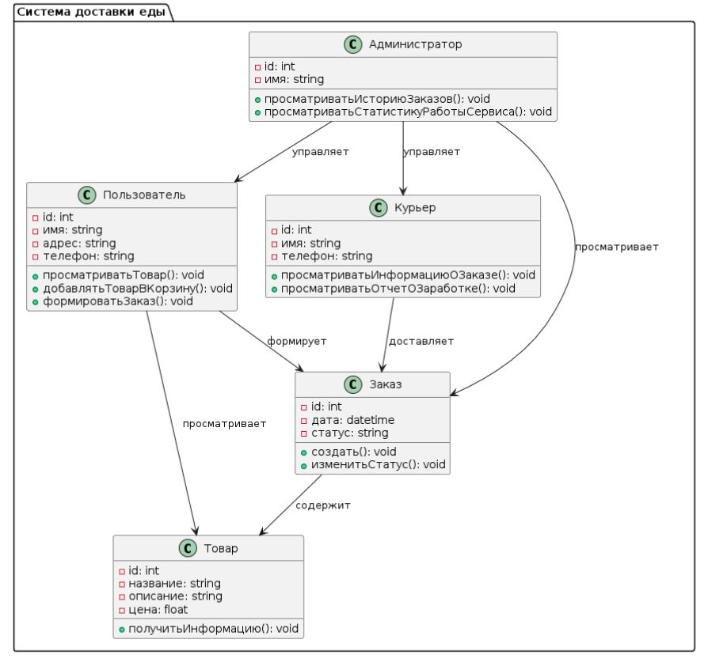

# Система Доставки Еды

Система доставки еды представляет собой комплексный сервис, включающий три роли: Администратор, Пользователь и Курьер.

## Пользователь

Пользовательская часть системы ориентирована на удобство и интуитивность. Пользователь может:
- Просматривать ассортимент доступных товаров
- Детально изучать информацию о каждом продукте, включая описание, цену и отзывы
- Добавлять товары в корзину, корректировать количество и наименование товаров
- Формировать заказ, указывая адрес доставки и способ оплаты
- Отслеживать статус своего заказа в реальном времени
- Получать уведомления о текущем состоянии доставки

## Курьер

Курьерская часть системы предназначена для упрощения работы курьеров. Курьеры могут:
- Видеть список назначенных им заказов
- Просматривать детальную информацию о каждом заказе, включая адрес доставки и контактную информацию пользователя
- Отмечать заказ как выполненный после успешной доставки
- Доступ к отчетам о выполненных заказах, где отображается сумма заработанных денег за каждый выполненный заказ
Это позволяет курьерам легко отслеживать свой доход и планировать рабочее время.

## Администратор

Администратор играет ключевую роль в обеспечении качества сервиса и решении возникающих проблем. Администратор может:
- Иметь доступ к истории заказов всех пользователей и курьеров, что позволяет анализировать и решать проблемы, связанные с доставкой
- Просматривать статистику работы сервиса, включая количество выполненных заказов, среднее время доставки, оценки пользователей и другие важные показатели
Это помогает в стратегическом планировании и улучшении качества сервиса.

## UML Диаграммы
### Диаграмма использований

скрипт PlantUML


### Диаграмма последовательности

скрипт PlantUML


### Диаграмма состояний заказа

скрипт PlantUML


### Диаграмма деятельности

скрипт PlantUML


### Диаграмма классов для системы

скрипт PlantUML
```plantuml
@startuml
package "Система доставки еды" {
    class Пользователь {
        - id: int
        - имя: string
        - адрес: string
        - телефон: string
        + просматриватьТовар(): void
        + добавлятьТоварВКорзину(): void
        + формироватьЗаказ(): void
}
    class Курьер {
        - id: int
  - имя: string
        - телефон: string
        + просматриватьИнформациюОЗаказе(): void
        + просматриватьОтчетОЗаработке(): void
}
    class Администратор {
        - id: int
        - имя: string
        + просматриватьИсториюЗаказов(): void
        + просматриватьСтатистикуРаботыСервиса(): void
}
    class Товар {
        - id: int
        - название: string
        - описание: string
        - цена: float
        + получитьИнформацию(): void
}
    class Заказ {
        - id: int
        - дата: datetime
        - статус: string
        + создать(): void
        + изменитьСтатус(): void
}
    Пользователь --> Заказ : формирует
    Пользователь --> Товар : просматривает
    Заказ --> Товар : содержит
    Курьер --> Заказ : доставляет
    Администратор --> Заказ : просматривает
    Администратор --> Курьер : управляет
    Администратор --> Пользователь : управляет
} @enduml
```
# tz3
